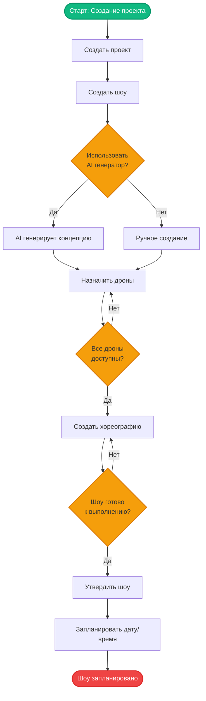
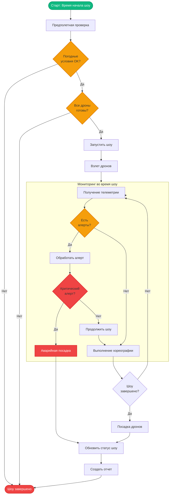
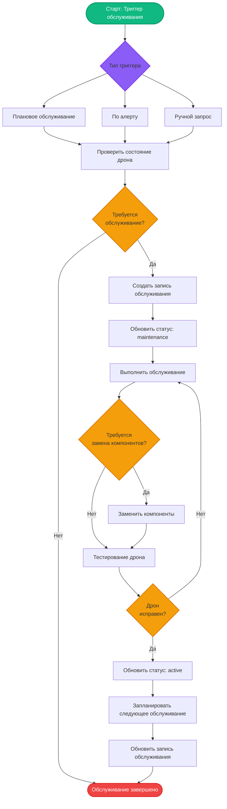
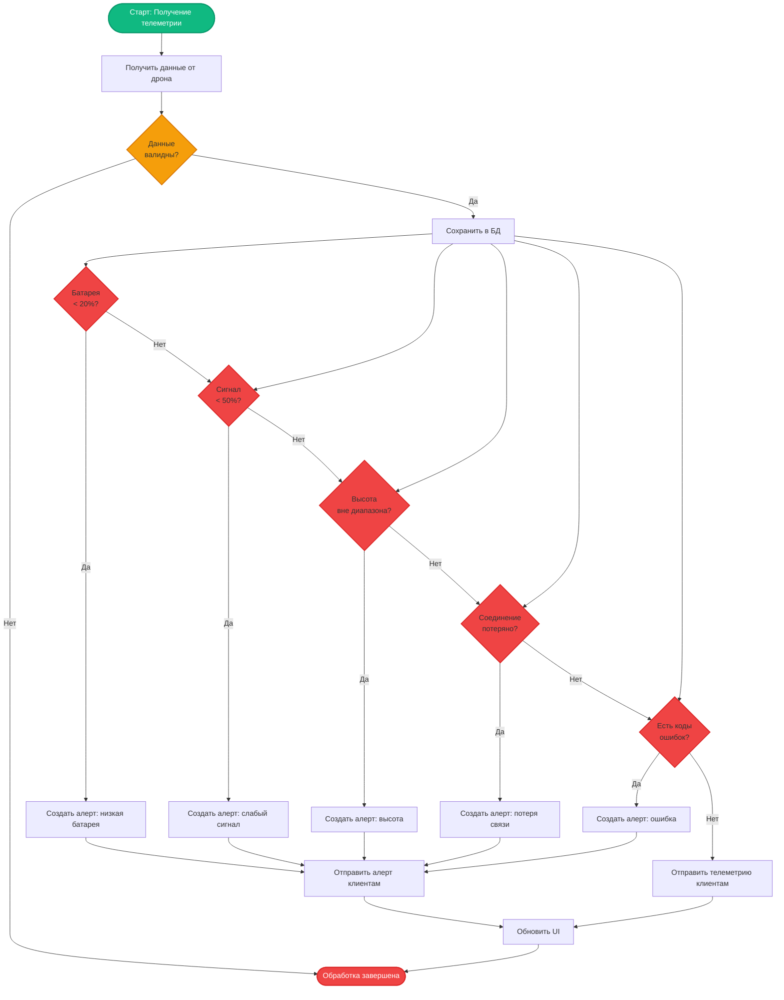
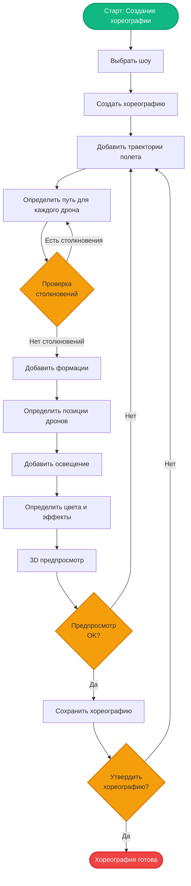
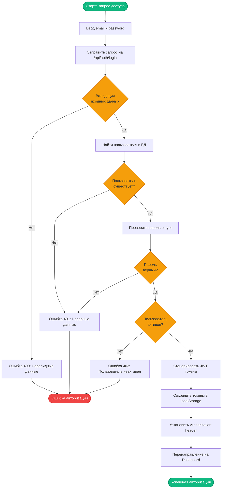

https://mermaid.live/
# BPMN диаграммы - Бизнес-процессы системы

## 1. Процесс создания и планирования шоу

## 2. Процесс выполнения шоу

## 3. Процесс технического обслуживания дрона

## 4. Процесс обработки телеметрии и генерации алертов

## 5. Процесс создания хореографии

## 6. Процесс аутентификации и авторизации

