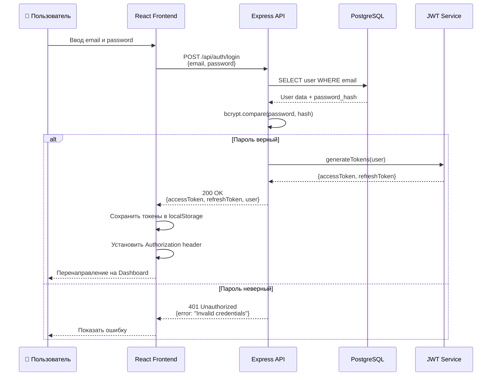
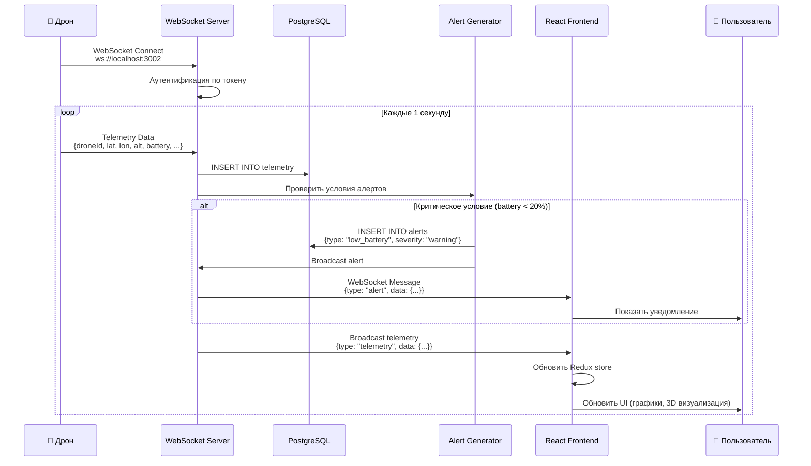
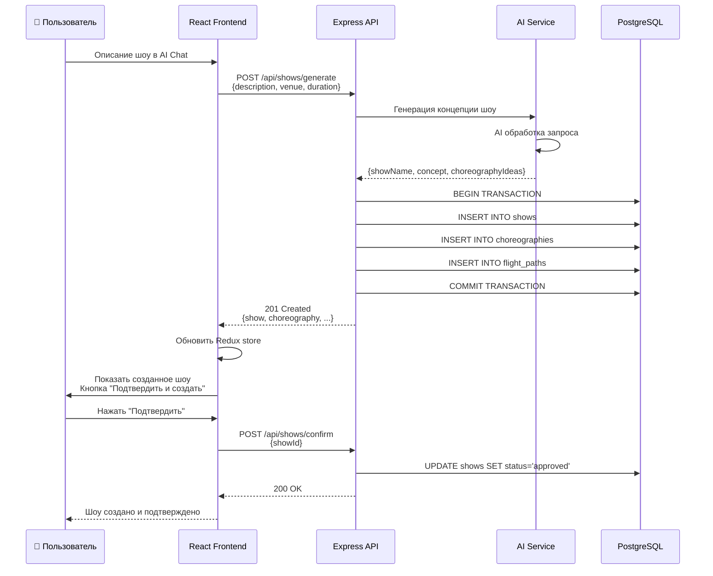
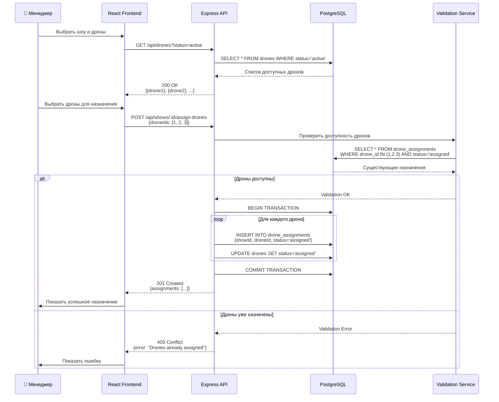
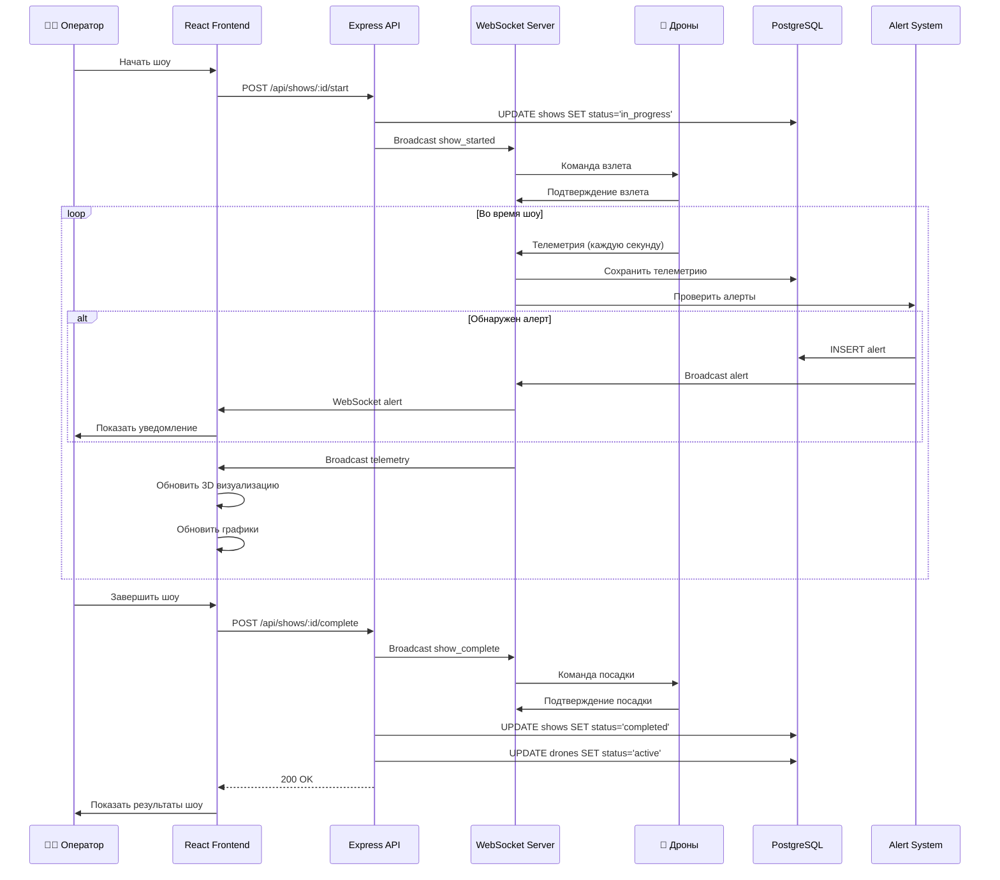
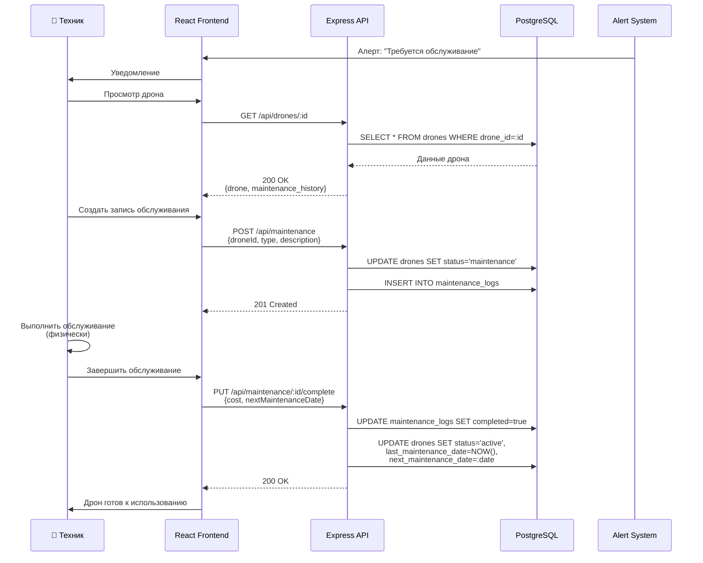
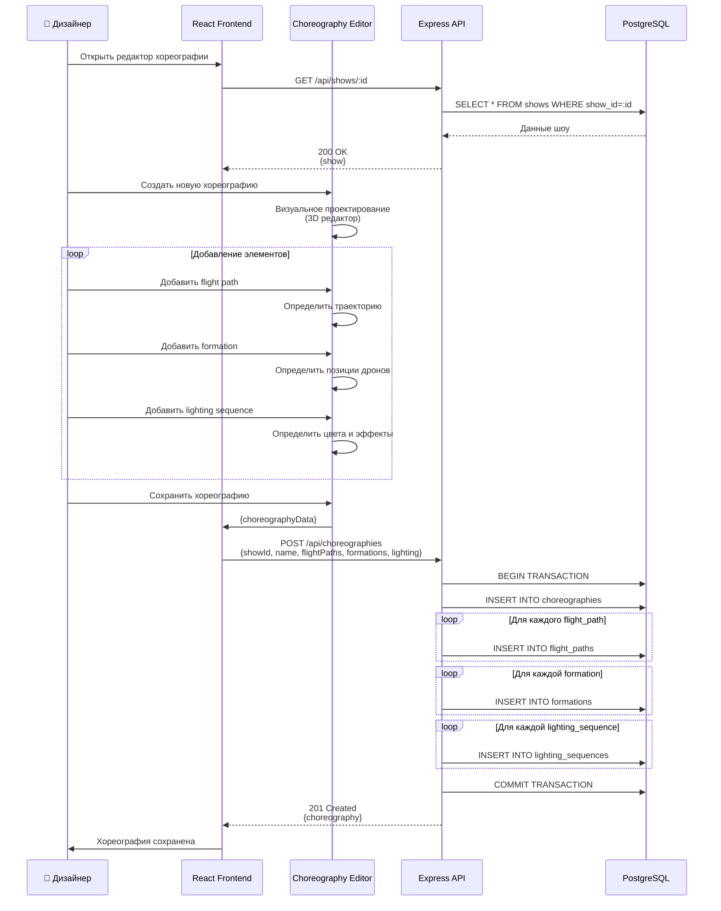

# Диаграммы последовательности - Процессы работы системы

## 1. Процесс аутентификации и авторизации

## 2. Процесс получения телеметрии в реальном времени

## 3. Процесс создания шоу через AI генератор

## 4. Процесс назначения дронов на шоу

## 5. Процесс выполнения шоу с мониторингом

## 6. Процесс технического обслуживания дрона

## 7. Процесс создания хореографии

