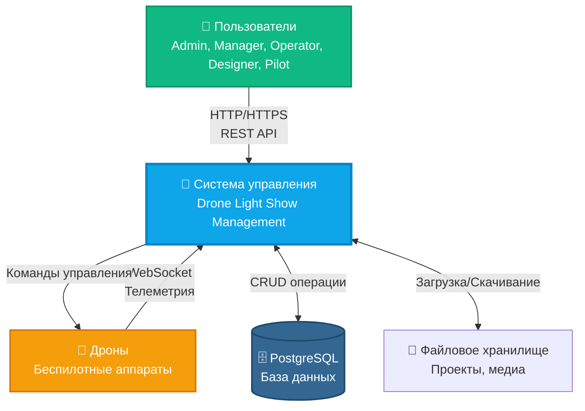
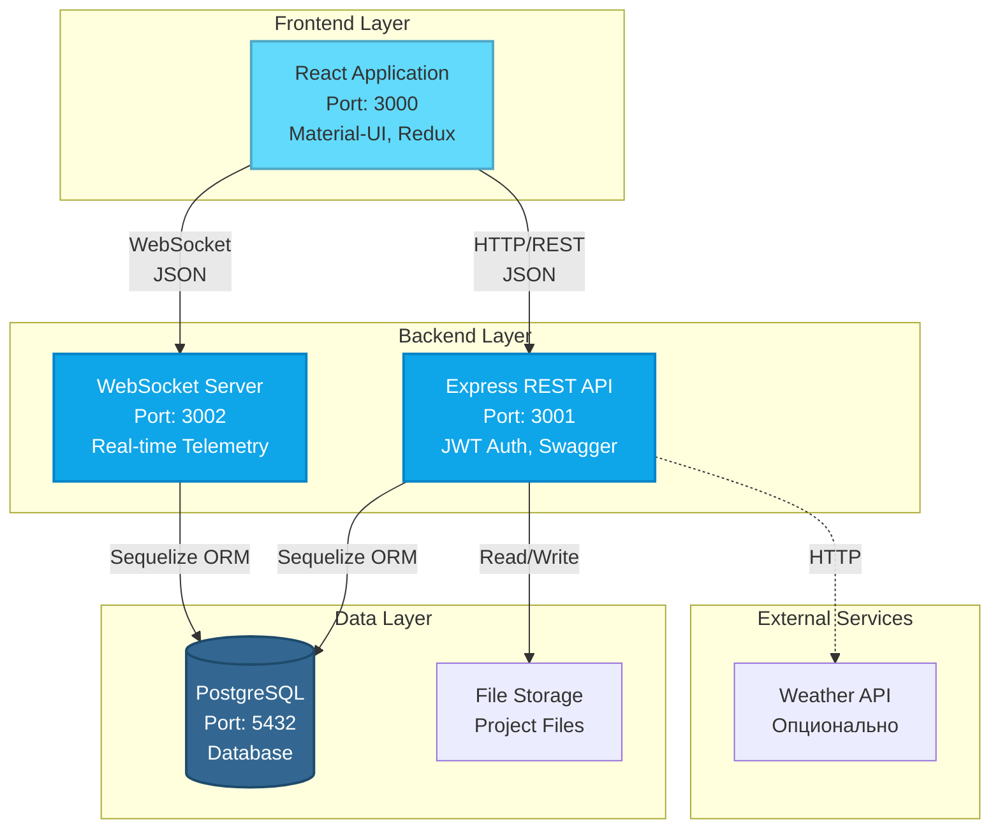
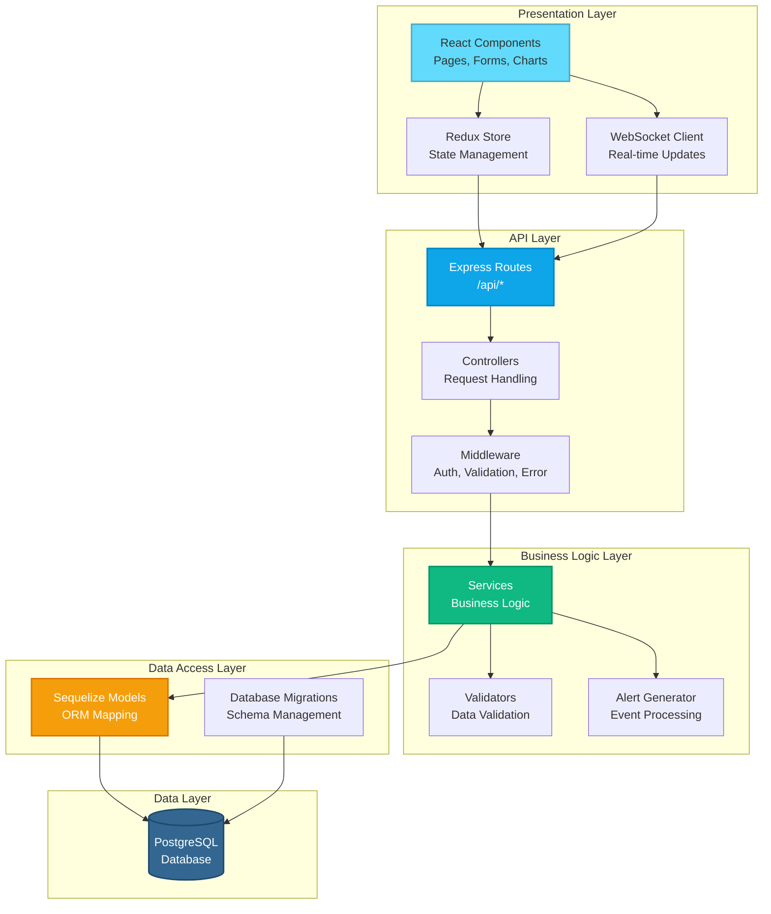
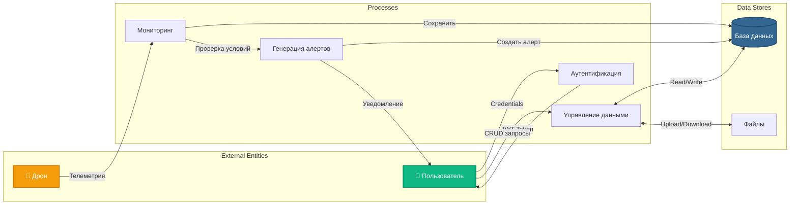
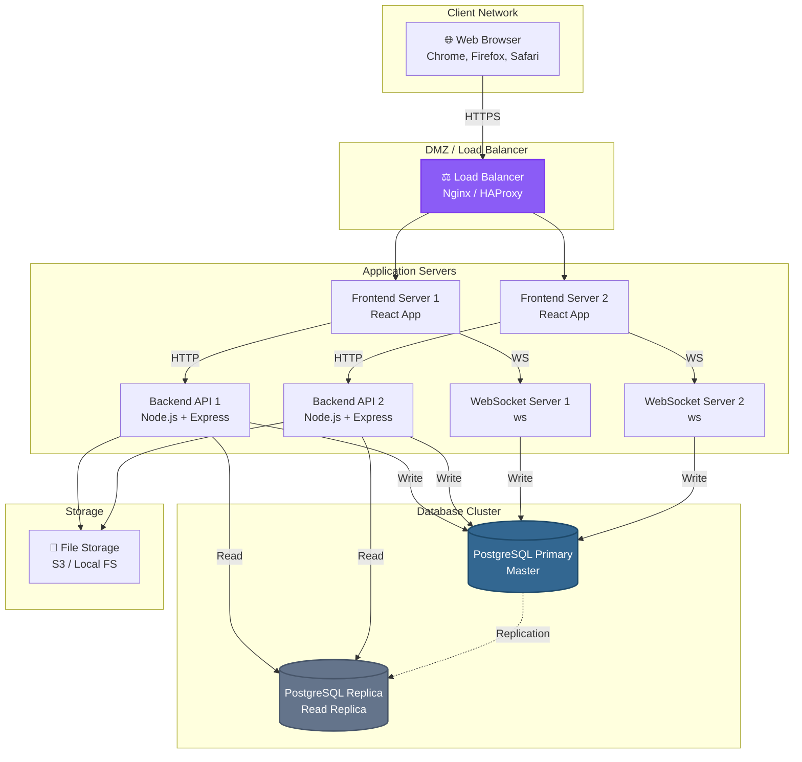

# Архитектура системы управления световыми шоу дронов

## 1. Общая архитектура системы (System Context)

## 2. Компонентная архитектура (Container Diagram)

## 3. Слоистая архитектура (Layered Architecture)

## 4. Поток данных (Data Flow Diagram)

## 5. Сетевая архитектура (Network Architecture)

