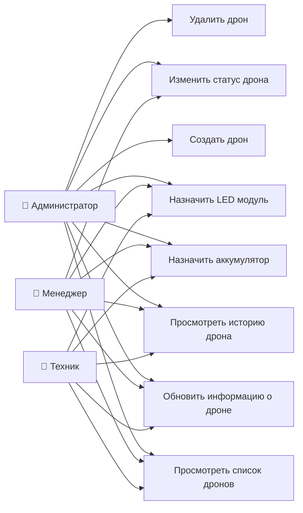
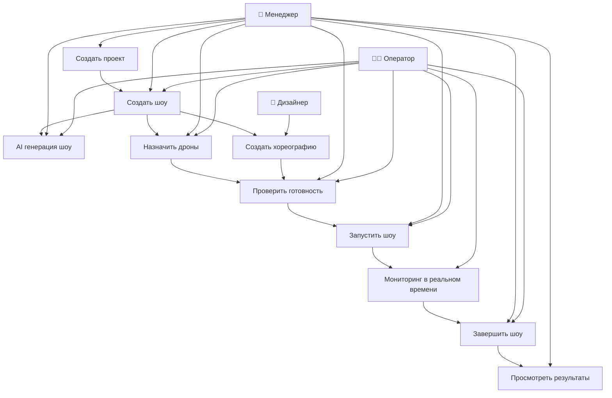
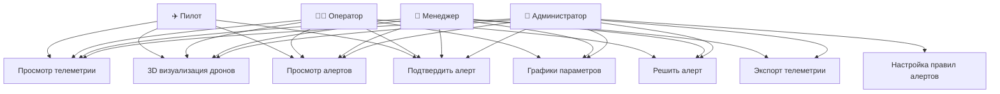
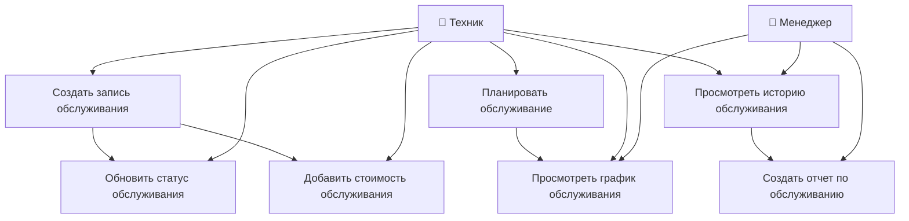

# Use Case диаграммы - Функциональность системы

## 1. Общая Use Case диаграмма

```mermaid
graph TB
    subgraph "Актеры"
        Admin[👑 Администратор]
        Manager[👔 Менеджер]
        Operator[👨‍💼 Оператор]
        Designer[🎨 Дизайнер/Хореограф]
        Technician[🔧 Техник]
        Pilot[✈️ Пилот]
    end
    
    subgraph "Use Cases - Управление"
        UC1[Управление пользователями]
        UC2[Управление ролями]
        UC3[Управление дронами]
        UC4[Управление аккумуляторами]
        UC5[Управление LED модулями]
        UC6[Управление клиентами]
    end
    
    subgraph "Use Cases - Проекты и шоу"
        UC7[Создание проекта]
        UC8[Создание шоу]
        UC9[AI генерация шоу]
        UC10[Назначение дронов]
        UC11[Планирование шоу]
    end
    
    subgraph "Use Cases - Хореография"
        UC12[Создание хореографии]
        UC13[Редактирование хореографии]
        UC14[Определение траекторий]
        UC15[Создание формаций]
        UC16[Настройка освещения]
    end
    
    subgraph "Use Cases - Мониторинг"
        UC17[Просмотр телеметрии]
        UC18[3D визуализация]
        UC19[Графики и аналитика]
        UC20[Управление алертами]
    end
    
    subgraph "Use Cases - Обслуживание"
        UC21[Создание записи обслуживания]
        UC22[Планирование обслуживания]
        UC23[Просмотр истории обслуживания]
    end
    
    subgraph "Use Cases - Отчеты"
        UC24[Просмотр отчетов]
        UC25[Экспорт данных]
        UC26[Аналитика проектов]
    end
    
    Admin --> UC1
    Admin --> UC2
    Admin --> UC3
    Admin --> UC4
    Admin --> UC5
    Admin --> UC6
    Admin --> UC24
    Admin --> UC25
    
    Manager --> UC3
    Manager --> UC4
    Manager --> UC5
    Manager --> UC6
    Manager --> UC7
    Manager --> UC8
    Manager --> UC9
    Manager --> UC10
    Manager --> UC11
    Manager --> UC17
    Manager --> UC20
    Manager --> UC24
    Manager --> UC26
    
    Operator --> UC7
    Operator --> UC8
    Operator --> UC9
    Operator --> UC10
    Operator --> UC11
    Operator --> UC17
    Operator --> UC18
    Operator --> UC19
    Operator --> UC20
    
    Designer --> UC12
    Designer --> UC13
    Designer --> UC14
    Designer --> UC15
    Designer --> UC16
    Designer --> UC8
    
    Technician --> UC3
    Technician --> UC4
    Technician --> UC5
    Technician --> UC21
    Technician --> UC22
    Technician --> UC23
    
    Pilot --> UC17
    Pilot --> UC18
    Pilot --> UC20
    
    style Admin fill:#ef4444,stroke:#dc2626,stroke-width:2px,color:#fff
    style Manager fill:#0ea5e9,stroke:#0284c7,stroke-width:2px,color:#fff
    style Operator fill:#10b981,stroke:#059669,stroke-width:2px,color:#fff
    style Designer fill:#8b5cf6,stroke:#7c3aed,stroke-width:2px,color:#fff
    style Technician fill:#f59e0b,stroke:#d97706,stroke-width:2px,color:#fff
    style Pilot fill:#06b6d4,stroke:#0891b2,stroke-width:2px,color:#fff
```

## 2. Use Case - Управление дронами

## 3. Use Case - Планирование и выполнение шоу

## 4. Use Case - Мониторинг и алерты

## 5. Use Case - Техническое обслуживание

